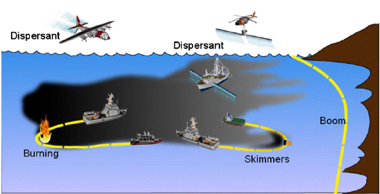

# Oil_Spill_Optimization

## Initial Steps:
-Find the oil spill accident with the most informatioon available.

 -Mainly:
 1. Exact position.
 2. Amount and composition of spilled oil.
 3. Plan that had been followed for the oil recovery.
 
 [connection wity site(s)]()
 
 
